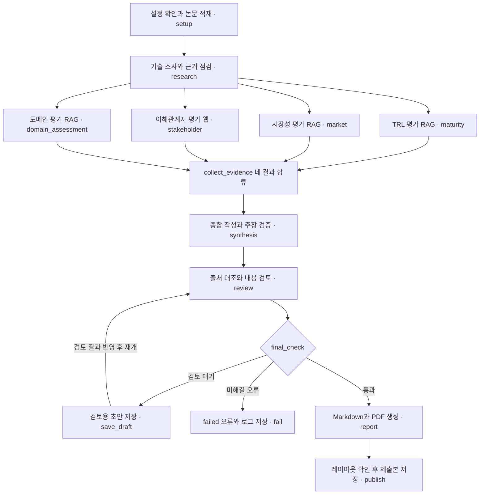

# KV cache 최적화 기술 다관점 평가

SW 압축(**TurboQuant**) vs HW 메모리 접근(**ITME**) — 데이터센터/클라우드 도메인
LangGraph Multi-Agent + Agentic RAG 기반 평가 보고서 자동 생성

**판교 8반** · 권수진 · 권예리 · 김민 · 박인기 · 정승원

## R1 구현 브랜치 안내 (2026-09-22)

브랜치 `feat/r1-graph-state-schema`. 최신 설계서의 **공용 스키마·State·그래프·실행 제어**를
구현한다. R3(검색·웹 근거·이해관계자)는 main에 들어와 있다.

**아래 3절 이후 본문은 이전 설계 기록이다.** R2/R4/R5가 새 계약으로 이행하면 각자 고친다.
특히 구버전의 `validate_eval`/`validate_final`/`abort`, 관점 dict `{text, citations, gaps}`,
`evidence` 단일 쓰기 주체, RRF 설정은 더 이상 현행이 아니다.
State와 그래프는 설계서 §7 표와 부록 A 그래프 소스를 그대로 옮겼다.

| 바뀐 것 | 어디 |
|---|---|
| 공용 모델 Claim/Assessment/Source/Evidence/Gap/Synthesis/Event | [`src/schema.py`](src/schema.py) |
| State — 설계서 §7 표 그대로(14행 / 17필드), 필드별 쓰기 주체 | [`src/state.py`](src/state.py) · [interface.md ①](docs/interface.md) |
| 그래프 — 부록 A 소스 그대로, 조건부 엣지는 `final_check` 하나 | [`src/graph.py`](src/graph.py) |
| 내용 검토 계약 `validation`·`review_status` | [interface.md ④](docs/interface.md) |
| run_id·`runs/<run_id>/`·run_status·검토 후 재개 | [`app.py`](app.py) |

- R1 인수·검증 결과: [docs/r1-handoff.md](docs/r1-handoff.md)
- 4경로 실행 증빙: [docs/evidence/r1/runs/checks.json](docs/evidence/r1/runs/checks.json)
- R3 계약과 인수 기록: [interface.md](docs/interface.md#r3-최신-설계서-적용-계약-2026-09-22) · [r3-handoff.md](docs/r3-handoff.md)

```bash
uv sync --extra test
uv run pytest -q
uv run python -m scripts.r1_smoke --root /tmp/kv-r1-run    # 그래프 4경로 (mock)
uv run python -m scripts.r3_smoke --root /tmp/kv-r3-run    # 검색·웹 (합성 fixture)
```

`uv run python app.py` 는 **검토 대기에서 멈춘다.** 실패가 아니라 설계서 §8 이 요구하는
사람의 내용 검토 단계다. 전체 절차는 [7. 실행](#7-실행) 참고.
smoke 가 남기는 보고서·주장은 합성 데이터이며 실제 기술 평가가 아니다.

---

## 1. 무엇을 하는가

KV cache는 연산 병목을 메모리 병목으로 옮겨 놓았다. SW 진영은 **데이터를 작게**,
HW 진영은 **공간을 넓게** 접근한다. 이 시스템은 두 기술을 TRL·시장성·이해관계자·도메인
네 관점에서 조사하고, **관점 간 근거가 어디서 일치하고 어디서 상충하는지**를 정리한다.

> **우열 판정을 하지 않는다.** 승자를 뽑는 게 아니라 왜 관점마다 답이 달라지는지를 쓴다.

---

## 2. 시스템 구조



설계서 부록 A의 그래프 소스를 그대로 옮긴 것이다. `docs/evidence/r1/graph.mmd`가
실제 컴파일된 그래프다.

**재시도는 노드 내부의 최대 1회 처리다**(부록 A). 그래서 조건부 엣지는 `final_check`
하나뿐이고, 되돌아오는 엣지는 `save_draft → review`(검토 결과 반영 후 재개) 하나뿐이다.
`final_check`는 인용 오류와 사람의 내용 검토 완료 여부를 함께 확인한다.

**검토 대기는 초안만 저장하고 멈춘다.** 사람의 검토 결과가 있어야 `review`로 돌아갈 수
있으므로 `save_draft` 뒤에서 실행이 정지한다. 사람이 `draft.json`의 `validation`·
`review_status`를 고치고 `app.py --resume <run_id>`로 내용 검토부터 이어 간다.

**병합 오류는 분기가 아니라 예외다.** 같은 ID에 다른 내용이 들어오면 어느 원문을
가리키는지 고를 근거가 없다(§7). `merge-errors.json`을 남기고 실행을 끝낸다 —
어긋난 근거로 종합·검토에 LLM을 태우지 않는다.

**`collect_evidence`는 다섯 Assessment를 병합한다.** 기술 조사 근거도 레지스트리에 있어야
참고문헌을 실제 인용에서 역으로 만들 수 있다(§8·§9).

### 에이전트 7종

| 노드 | 역할 | RAG | 근거 출처 |
|---|---|:---:|---|
| `research` | 접근 방식·적용 범위·한계 추출, `tech_status` 판정 | **O** | `papers_core` |
| `maturity` | TRL 규칙표로 성숙도 판정 | **O** | `papers_core` (다른 쿼리) |
| `market` | 규모·채택·생태계 | **O** | `ecosystem` |
| `stakeholder` | 경쟁·도입·개발자·투자 반응 | X | 웹 (색인 안 함) |
| `domain_assessment` | 데이터센터/클라우드 적합성 | **O** | `papers_core` + `context` |
| `synthesis` | 일치·상충·gaps 병합, 결합 가설 분리 | X | State 읽기 전용 |
| `report` | 목차 조립 | X | 결정적 포맷터 |

가이드 원안 6개에 **TRL 전담 노드를 추가해 7개**. TRL은 4대 평가 관점인데 원안 표에
전담 노드가 없어, 시장 노드가 겸하면 "논문 실험 근거"와 "시장 매출 근거"가 섞인다.

---

## 3. 차별점

**① 근거의 소재에 따라 검색 경로를 나눴다**
시장 근거는 논문 본문에 없다. `papers_core`에서 시장을 검색하면 **의미적으로 가장 가까운
기술 서술**(성능 수치, 실험 하드웨어)이 회수돼 시장 근거 자리에 놓이고, LLM이 그걸로
시장성 주장을 만든다. "자료가 없으면 미확인" 원칙이 무력화된다.
→ 시장 근거를 **`ecosystem` 컬렉션으로 따로 색인**하고, `market` 노드는 그 컬렉션만 본다.
실시간 웹 조회 대신 색인을 택한 이유는 재현성과 200쪽 가드 안에서의 관리다.

**② 우열 판정을 프롬프트가 아니라 스키마로 막았다**
`conflicts: list[Conflict] = Field(min_length=1)`. 관점별 상충이 0건이면 구조 검증에서
걸린다. `favors`는 "종합 승자"가 아니라 "이 관점의 근거가 유리하게 읽히는 쪽"으로 정의된다.
결합 가설은 별도 필드로 빼서 §5.4에만 배치했다. → `src/agents/synthesis.py`

**③ evidence 단일 쓰기 주체**
`maturity`·`domain_assessment`도 인덱스를 조회하지만 `evidence`에 쓰지 않고 자기 키에만
반영한다. 병렬 fan-out에서 동시 쓰기가 **구조적으로 불가능**하다. 누적 reducer는 `trace` 하나.

**④ 인용 검증은 LLM이 아니라 결정적 검사, 그것도 2단계**
`validate_eval`(평가 재실행) / `validate_final`(종합 재작성). 한도 초과 시 조용히
통과시키지 않고 `abort` 노드가 실패를 보고서 자리에 남긴다. → `src/output/validate.py`

**⑤ BM25만 영어 키워드로 변환한다**
BM25는 어휘 매칭이라 한국어 질의로 영어 논문을 못 찾는다. 반면 e5-small은
cross-lingual이라 **한국어 원문 질의를 그대로 넣는 게** 이 모델을 쓰는 이유다.
→ dense는 원문 질의, BM25만 고정 용어사전으로 변환. LLM 번역을 쓰지 않아
지연·비용이 없고 실행 간 결과가 흔들리지 않는다. 변환 이력은 `trace`에 남는다.

---

## 4. RAG 설계

### 3 컬렉션 (설계서 §3)

출처 목록은 [`sources.json`](sources.json), 수집·해시·쪽수는
[`scripts/prepare_sources.py`](scripts/prepare_sources.py) 가 만드는
`data/manifest.json` 이 단일 원천이다. 상세는 [docs/corpus-prep.md](docs/corpus-prep.md).

| 컬렉션 | 문서 | 쪽 | 용도 |
|---|---|---:|---|
| `papers_core` | turboquant-paper `direct` · itme-paper `direct` · infinigen-paper `comparison` · pim-cxl-paper `comparison` | 70 | research · maturity · domain |
| `ecosystem` | turboquant-blog · cxl-whitepaper · vllm-quantized-kvcache · vllm-prefix-caching · skhynix-cmm-validation | 15.4 | market |
| `context` | kv-cache-survey `secondary` (1~32쪽만 발췌, 참고문헌 제외) | 32 | domain (배경 서술만) |
| (웹 조회) | 이해관계자 반응 — 색인 안 함 | — | stakeholder |
| | **합계** | **117.4 / 200** | |

> `papers_core`에 InfiniGen·PIM-CXL(비교군)을 그대로 뒀다. 애초 계획은 이 둘을
> ecosystem/context로 옮겨 38/48.3/35쪽 배분에 맞추는 것이었지만, R3가 구현한
> `ROLE_COLLECTIONS`(`src/rag/retrieve.py`)가 `maturity`·`domain` 역할을 `papers_core`
> (+`context`, domain만)로만 제한해서, 옮기면 두 비교군 논문이 TRL·도메인 평가에서
> 아예 검색되지 않는다. 정확한 쪽수 배분보다 기능적 도달 가능성을 우선했다 — 정확한
> 배분이 꼭 필요하면 R3·R4와 `ROLE_COLLECTIONS` 확장을 논의할 것.

웹 문서는 **A4·9.5pt 기준 3,200자 = 1쪽**으로 환산해 가드에 합산한다.
매니페스트에 SHA-256 · 수집일 · 쪽수 · `page_basis` 를 기록한다.

`scope` 로 근거의 격을 나눈다 — `direct`(선정 기술 1차) / `comparison`(계열 비교) /
`ecosystem`(인접 생태계, 직접 채택 근거 아님) / `secondary`(2차 자료).
`perspectives` 는 어느 노드가 그 문서를 볼 수 있는지를 정한다. 검색 시 필터로 걸어
**비교군 논문이 기술 조사의 1차 근거로 올라오지 않게** 한다.

> `papers_core` 는 ITME 계열 3편 : TurboQuant 계열 1편으로 비대칭이다.
> 필터가 랭킹 뒤에 걸리므로, 기술·관점 필터가 있을 때는 검색 풀을 4배로 키워
> 한 기술 근거가 통째로 밀려나지 않게 한다(설계서 §5 확증 편향 완화).

### 청킹

**토큰 400 / overlap 80**, 임베딩 입력 한도 512 상한.
`RecursiveCharacterTextSplitter.from_huggingface_tokenizer`로 토큰 기준 분할한다.
**표는 행 단위로 쪼개되 매 조각에 헤더 행을 반복**한다 — 표를 통째로 자르면 행이 어느
열에 속하는지 잃어버려 벤치마크 수치 인용이 망가진다.
청크 ID는 `(출처, 페이지, 본문 해시)`라 재실행해도 인용 ID가 안정적이다.

### 검색

**dense(FAISS, 원문 질의) 단독.** 애초엔 BM25(영어 키워드 변환 질의)와 RRF로 융합할
계획이었으나, R3가 검색 품질 실측 없이 하이브리드를 유지할 근거가 없다고 판단해
dense만 남겼다(`src/rag/retrieve.py`, `mode='rrf'`는 이제 `ValueError`). `technology`
필터로 기술별 검색량을 균형 유지하고, `perspective`로 역할별 컬렉션·scope 접근을 강제한다
(`ROLE_COLLECTIONS`/`ROLE_SCOPES`). 키워드 변환용 `src/rag/query_kw.py`는 BM25 축이
없어져 더 이상 검색 경로에서 쓰이지 않는다(레거시, 제거 가능).

### 임베딩 모델 선정 (설계서 §4)

선정 근거는 리더보드 순위가 아니라 **입력 언어(한국어 질의 + 영어 논문), 원문 길이,
로컬 연산/메모리 비용**이다.

| 후보 | 적용 근거 | 결정 |
|---|---|---|
| **multilingual-e5-small** | 한/영 혼재 검색, 384차원, CPU 로컬 실행 | **채택** |
| BGE-M3 | 다국어·긴 입력 | 제외 — 400토큰 청크 설계라 장문 지원이 필요한 전환 조건이 없음. 더 큰 벡터·모델 비용 대비 이득 없음 |
| all-MiniLM-L6-v2 | 짧은 영어 문장 | 제외 — 영어 전용이라 한국어 질의 회수 불가 |

`revision`·차원(384)을 고정해 재실행 간 인덱스가 흔들리지 않게 한다.

**실측** — 설계서 §4 "측정 예정" 칸을 아래로 대체 (2026-09-22, `uv run python -m eval.retrieval_metrics`, mode=dense 단일)

| 구분 | n | Hit@1 | Hit@3 | Hit@5 | MRR@1 | MRR@3 | MRR@5 |
|---|---|---|---|---|---|---|---|
| 전체 | 20 | 0.700 | 0.850 | 0.950 | 0.700 | 0.767 | 0.792 |
| ko | 10 | 0.500 | 0.700 | 0.900 | 0.500 | 0.600 | 0.650 |
| en | 10 | 0.900 | 1.000 | 1.000 | 0.900 | 0.933 | 0.933 |

완전 회수율(같은 사실의 ko·en 문항이 **모두** 회수된 비율) — fact 10건 기준:
@1 = 0.500 · @3 = 0.700 · @5 = 0.900

> ko 회수율이 en보다 뚜렷이 낮다(Hit@1 0.500 vs 0.900). e5-small이 cross-lingual이라도
> 한국어 질의 쪽이 상대적으로 더 어렵게 매칭된다는 신호다 — ko 질의 표현을 좀 더
> 원문 어휘에 가깝게 다듬을 여지가 있다. n=10이라 `⚠ 표본 부족(경향만)` 경고가 뜬다.
> 24~30문항으로 늘리면 신뢰도가 올라간다.
>
> ⚠️ RRF/BM25 하이브리드는 R3가 실측 근거 없이 제거해 더 이상 존재하지 않는다
> (`src/rag/retrieve.py`의 `mode='rrf'`는 `ValueError`). 위 표는 dense 단일 모드다.

**실패한 질의 패턴** (설계서 §10 공개 요구) — top-5 안에서도 정답 청크를 못 찾은 문항:

```bash
uv run python -m eval.find_failed_queries
```

> Hit@5=0.950(20문항 중 1건 실패)이므로 ko 문항 1건이 top-5 밖으로 밀린다. 정확히 어떤
> 문항인지, 대신 무엇이 반환됐는지는 위 명령 실행 결과로 채운다. _(실행 후 이 자리에
> 문항 ID·질문·반환된 상위 문서를 채워 넣을 것)_

```bash
uv run python scripts/prepare_sources.py --verify
uv run python -m scripts.ingest
uv run python -m eval.retrieval_metrics
uv run python -m eval.find_failed_queries
```

> 개발용 검색 점검이며 답변의 사실성을 증명하지 않는다.

---

## 5. State 17키

각 평가 관점은 **자기 키만** 갱신한다. 누적 reducer는 `trace` 하나뿐이다.
관점 dict 공통 구조는 `{text, citations, gaps}`.

| 키 | 단독 쓰기 주체 |
|---|---|
| `domain` · `sources` | 입력 / 인덱스 매니페스트 |
| `evidence` · `research` · `tech_status` · `gaps` · `retrieval_round` | `research` |
| `maturity` / `market` / `domain_assessment` | 각 노드 |
| `stakeholder` · `web_sources` | `stakeholder` |
| `synthesis` | `synthesis` |
| `validation_errors` · `validation_round` | `output/validate.py` |
| `report` | `report` / `abort` |
| `trace` | 전 노드 (`operator.add`) |

---

## 6. Directory Structure

```
├── sources.json            # 코퍼스 출처 명세 (R2)
├── scripts/
│   ├── prepare_sources.py  # 원문 수집 + data/manifest.json 생성 (R2)
│   ├── ingest.py            # 인덱스 점검 스모크 테스트 (R2)
│   └── r3_smoke.py          # R3 합성 데이터 재현 실행
├── data/
│   ├── raw/                 # 원문 (Git 제외, prepare_sources.py 로 재생성)
│   └── manifest.json        # 해시·쪽수·버전 기록 (생성 산출물)
├── src/
│   ├── state.py, graph.py, llm.py, settings.py   # R1
│   ├── rag/{chunk,embed,index}.py                # R2
│   ├── rag/retrieve.py                           # R3
│   ├── tools/{docs,web_search,web_fetch,web_store,load_paper}.py  # R2/R3
│   ├── agents/{research,maturity,domain}.py       # R4
│   ├── agents/{market,stakeholder,stakeholder_contract}.py  # R3
│   ├── agents/{synthesis,report}.py               # R5
│   └── output/{validate,reference,pdf}.py         # R5
├── eval/
│   ├── goldenset.json          # 검색 평가셋 20문항 (R2)
│   ├── retrieval_metrics.py    # Hit@K·MRR@K 집계 (R4)
│   └── find_failed_queries.py  # top-5 실패 질의 목록 (R2)
├── docs/                    # interface.md 등 팀 계약 문서
├── config/settings.yaml     # 실행 설정 (R1)
├── app.py                   # 전체 파이프라인 실행 스크립트
└── README.md
```

## 7. 실행

### 0. 준비

```bash
uv sync                          # 파이프라인 의존성
uv sync --extra pdf              # PDF 제출본까지 만들 때만
brew install pango               # macOS. weasyprint 가 libpango 를 요구한다
cp .env.example .env
```

`.env` 에 키 두 개가 필요하다. **둘 다 없으면 실행이 시작되지 않는다.**

| 키 | 쓰는 곳 | 없으면 |
|---|---|---|
| `OPENAI_API_KEY` | 기술 조사·TRL·시장성·도메인·이해관계자·종합 | `get_llm()` 이 `OpenAIError` 로 즉시 중단 |
| `TAVILY_API_KEY` | 이해관계자 노드의 웹 검색 | stakeholder 가 `status=failed` → 실행 전체 failed |

`pango` 가 없어도 파이프라인은 정상 종료한다. Markdown 까지만 나오고 그 사실이
`runs/<run_id>/submission.json` 에 남는다.

### 1. 원문 수집 (최초 1회)

```bash
uv run python scripts/prepare_sources.py            # 기본: 해시만 검증 (재수집 안 함)
uv run python scripts/prepare_sources.py --refresh  # 원문 재수집 + 매니페스트 갱신
```

`data/raw/` 에 원문이, `data/manifest.json` 에 해시·분량 기록이 생긴다. 원문은 Git 에서
제외한다(15MB).

> **`--refresh` 는 함부로 쓰지 마라.** 원문이 바뀌면 청크가 바뀌고 `chunk_id` 가 전부
> 달라진다. 이전 실행의 인용이 가리키던 원문이 사라지고 `eval/goldenset.json` 라벨도
> 다시 해야 한다. 실제로 `turboquant-blog` 원문이 한 번 바뀐 적이 있다.

### 2. 인덱스 점검 (선택, API 키 불필요)

```bash
uv run python -m scripts.ingest
```

수집 → 200쪽 가드 → 청킹 → 컬렉션 분리 → 기술별 필터를 한 번에 확인한다.

### 3. 파이프라인 실행

```bash
uv run python app.py
```

`setup` 이 원문 SHA-256 을 매니페스트와 대조한다(설계서 §3). 어긋나면 경고를 출력하고
**실행을 중단한다** — 의도한 갱신이면 `--refresh` 로 매니페스트를 다시 만든다.

**첫 실행은 반드시 검토 대기로 멈춘다.** 실패가 아니다. 설계서 §8 이 *이 과정은 ID
대조만으로 자동 통과시키지 않는다. 팀원이 주장과 근거를 나란히 보고 확인한다* 라고
정한다. 이 단계에서는 보고서도 PDF 도 나오지 않는다.

```
검토 대기 — Claim 14건. runs/<run_id>/review.csv 의 review_result(확인|부결)·reviewer 를 채운 뒤
  uv run python app.py --resume <run_id>
```

### 4. 내용 검토

주장과 근거를 나란히 읽는다.

```bash
uv run python -m scripts.review_reader <run_id> --pending
uv run python -m scripts.review_reader <run_id> --claim <claim_id>   # 하나만
```

`runs/<run_id>/review.csv` 의 **마지막 세 열**만 채운다. 앞 열은 읽기용이다.

| 열 | 값 |
|---|---|
| `review_result` | `확인` 또는 `부결` (`통과`·`승인`·`ok` / `반려`·`reject` 도 받는다) |
| `reviewer` | 검토자 이름 |
| `review_comment` | 사유. **부결이면 보고서 §6 에 그대로 실린다** |

한 `claim_id` 당 **한 행만** 채우면 된다(같은 Claim 이 근거 수만큼 행을 갖는다).
값이 `확인`/`부결` 어느 쪽도 아니면 *판정 값 미상* 오류로 실행이 `failed` 가 된다.

§8 이 요구하는 확인 항목 — **성능 수치의 단위·비교 기준선·실험 조건, TRL 단계의 근거,
직접 채택과 인접 생태계 자료의 구분.**

### 5. 재개 → 보고서 + 제출본

```bash
uv run python app.py --resume <run_id>
```

| 산출물 | 경로 |
|---|---|
| 보고서 Markdown | `runs/<run_id>/report.md` |
| 제출본 PDF | `runs/<run_id>/final/RAG-Output_판교_8반_….pdf` |
| 생성 여부와 사유 | `runs/<run_id>/submission.json` |
| 검토 기록 | `runs/<run_id>/review.csv` |
| 실행 기록 | `runs/<run_id>/run.json` · `trace.jsonl` · `state.json` |

PDF 는 **검증을 통과했을 때만** 나온다(§8 — 무효 인용이 남으면 제출용 출력을 막는다).
품질 점검(SUMMARY 분량·한글 글꼴·표 잘림·참고문헌 위치, §9)에 걸려도 만들지 않는다.
왜 안 나왔는지는 `submission.json` 에 적힌다.

### run_status 읽는 법

| 값 | 뜻 |
|---|---|
| `completed` | 보고서 생성, 평가 보류 항목 없음 |
| `partial` | 검토 대기로 멈췄거나, 근거 공백이 남은 채 보고서를 냈다 |
| `failed` | Assessment 중 failed, 미해결 인용 오류, 병합 오류 |

---

## 재현성 — 어디까지 되고 어디부터 안 되는가

**같은 보고서가 다시 나오지 않는다.** 이 파이프라인은 그것을 목표로 하지 않는다.

| 단계 | 재현 |
|---|---|
| 원문 → 청킹 → 임베딩 → 인덱스 | ✅ 코퍼스 해시와 임베딩 revision(`src/rag/embed.py`)이 고정돼 있다 |
| 검색 결과 · `chunk_id` | ✅ 같은 인덱스면 동일 |
| **주장 문장** | ❌ 모델이 매 실행 다시 쓴다 |
| **이해관계자 근거** | ❌ 매 실행 웹을 새로 검색한다 |

측정값: 같은 코퍼스로 두 번 돌렸을 때 `maturity` 노드가 **인용 근거 5건이 완전히 같은데
본문 유사도 0.258** 이었다. `langchain_openai` 가 `gpt-5.6-luna` 에 대해 `temperature` 를
보내지 않고(추론형 모델로 취급) `seed` 도 무시되기 때문이다. 자세한 조사는
[docs/reproducibility-plan.md](docs/reproducibility-plan.md).

**클론한 사람이 같은 결과를 얻을 수 없다.** `data/raw/`(원문)와 `.cache/`(모델 응답
캐시)가 Git 에서 제외되고, 웹 검색 결과는 애초에 매일 바뀐다. 검증이 목적이라면 재실행이
아니라 `runs/<run_id>/` 의 보고서·근거·검토 기록을 직접 보는 쪽이 맞다.

### 재검토를 줄이는 두 장치

둘 다 재현성의 대체재가 아니라 **사람의 시간을 아끼는 안전망**이다.

**검토 판정 원장** `reviews/verdicts.json` (Git 에 커밋된다)
재개가 끝나면 판정이 자동으로 쌓인다. 다음 실행에서 **node·technology·kind·주장 문장·
인용 근거가 모두 같은** Claim 만 판정을 물려받는다. 한 글자라도 다르면 사람이 읽은 것이
아니므로 미판정으로 남는다. 이월된 판정은 보고서 §6 에 건수와 출처 run_id 가 공시된다.
전부 새로 검토하려면 `--no-carry-review`.

**모델 응답 캐시** `.cache/llm.sqlite` (Git 제외, 기계마다 따로 쌓인다)
키가 프롬프트 전문 + 모델 파라미터다. 같은 코퍼스·같은 지시문이면 같은 응답이 나온다.
프롬프트를 고치면 자동으로 새로 생성한다. 적중 수는 `run.json` 의 `llm` 과 보고서 §6 에
남는다 — 적중은 *이번 실행에서 모델이 새로 판단하지 않았다* 는 뜻이다.

이해관계자 노드는 매 실행 웹을 새로 조사하므로 **프롬프트가 달라져 캐시가 적중하지 않고,
그 Claim 들은 매번 새로 검토해야 한다.**

### 모델 설정

`config/settings.yaml` 의 `llm.model` 이 기본값이고 `.env` 의 `LLM_MODEL` 이 우선한다.
실제로 적용된 `temperature`·`seed` 는 `runs/<run_id>/run.json` 의 `llm` 에 기록된다
(설정 파일 값과 다를 수 있다 — 위 재현성 절 참고).

> ⚠️ **첫 실행 전 확인**: `gpt-5.6-luna` 가 팀 계정에서 호출되는지, 그리고
> **`with_structured_output`(tool calling)을 지원하는지**. 미지원이면 `synthesis` 의
> 구조화 출력이 무너진다. 안 되면 `.env` 에 `LLM_MODEL=gpt-4.1-mini`.

---

## 8. 담당

| 담당 | 트랙 | 파일 |
|---|---|---|
| **R1** | Graph & Runtime | `app.py` · `src/{state,graph,llm,settings}.py` · `src/agents/common.py` · `config/settings.yaml` |
| **R2** | RAG 인프라 (3 컬렉션) | `sources.json` · `scripts/prepare_sources.py` · `src/rag/{chunk,embed,index}.py` · `src/tools/load_paper.py` · `scripts/ingest.py` · `eval/goldenset.json` |
| **R3** | 검색 계층 + 시장성 + 이해관계자 | `src/rag/retrieve.py` · `src/tools/{docs,web_search,web_fetch,web_store}.py` · `src/agents/stakeholder{,_contract}.py` · `sources.json`의 ecosystem·context **자료 선별** |
| **R4** | 논문 소비 에이전트 + 검색 평가 | `src/agents/{research,maturity,domain}.py` · `eval/retrieval_metrics.py` |
| **R5** | 종합·보고서·출력 | `src/agents/{synthesis,report}.py` · `src/output/{validate,reference,pdf}.py` · `README.md` |

> `src/settings.py`는 v13 파일 목록에 없는 추가분(R1). R2·R4가 `top_k`·청킹 상수를
> R1의 `llm.py`를 거쳐 가져오는 역참조를 피하려고 분리했다.
>
> `eval/goldenset.json`·`eval/retrieval_metrics.py`는 원안엔 R2 단독 소유였지만, 실제로는
> R4도 자신의 에이전트 평가를 위해 `retrieval_metrics.py`를 다시 작성해 병합했다. 정리:
> **골든셋 데이터(20문항)는 R2**, **집계·리포트 스크립트는 R4** 버전을 쓴다. R2는 별도로
> `eval/find_failed_queries.py`(실패 질의 목록)만 추가했다.

### 시작 전 고정할 인터페이스 → [docs/interface.md](docs/interface.md)

1. `src/state.py` 17키의 형식 — **R1**
2. chunk 스키마와 `search_source_documents(collection 필수)` 시그니처, `sources.json` 의 `scope`·`perspectives` 값 목록 — **R2**
3. 관점 dict `{text, citations, gaps}` + citation 형식 `chunk_id` — **R1·R5**
4. **`validation_errors` 형식** `{node, kind, ids}` — **R5**가 쓰고 **R1**이 읽는 유일한 키

1~3만 정하면 R3~R5는 인덱스 완성 전에도 목업 청크로 개발을 시작할 수 있다.

---

## 9. Contributors

| 이름 | 담당 | 주요 산출물 |
|---|---|---|
| 김민 | Graph & Runtime | State 17키, 공용 schema.py(Claim/Assessment/Source/Evidence/Gap), LangGraph 배선(조건부 보완·fan-out/fan-in·2단계 검증 라우팅), run_id 기반 실행 제어 |
| 권수진 | RAG 인프라 | 3 컬렉션 재구성(excerpt 페이징), SHA-256·쪽수 매니페스트, 표/수식 깨짐 검토 마킹, `load_paper`, 검색 평가셋 20문항 |
| 정승원 | 검색 계층·시장성·이해관계자 | dense 코사인 검색(`retrieve.py`), 역할별 컬렉션/관점 잠금(`ROLE_COLLECTIONS`), 웹 근거 수집·스냅샷(`web_search/web_fetch/web_store`), 이해관계자 평가 노드 |
| 권예리 | 평가 에이전트 | 기술조사·TRL 규칙표·도메인 노드, 검색 품질 실측 스크립트(`retrieval_metrics.py`) 재작성 |
| 박인기 | 종합·출력 | _(git 커밋 이력만으로는 R5 구현 여부가 확인되지 않았습니다 — 본인이 직접 채워주세요: 구조 강제 종합, 인용 검증, REFERENCE 3구분, 한글 PDF 등)_ |

---

## 10. 보고서 목차 (`output/report.md`)

```
SUMMARY            핵심 평가 결과, ½쪽 이내
1. 분석 배경
2. 기술 선정
3. 기술 개요
4. 관점별 평가      4.1 TRL  4.2 시장성  4.3 이해관계자  4.4 도메인
5. 시사점          5.1 일치  5.2 상충  5.3 근거 공백  5.4 결합 가설(추론)
6. 한계
REFERENCE          [A] Doc Pool 논문  [B] 풀 밖 색인(ecosystem·context)  [C] 웹 조회
```

**REFERENCE 3구분 이유** — 설계서 §9는 "Doc Pool 논문만"이라 쓰고 §3·§6은 웹 자료도
인용한다고 쓴다. 그대로 두면 본문 인용이 참고문헌에 연결되지 않는다. [B]는 색인 대상이라
200쪽 가드에 포함되고, [C]는 색인하지 않으므로 무관하다.

**LLM Judge — 해당 없음.** 인용 검증은 인덱스 실물과 대조하는 결정적 검사이며,
별도 LLM 채점 점수를 만들지 않는다.

---

## 참고자료

- TurboQuant. arXiv:2504.19874 (2025-04) · ITME. arXiv:2606.12556 (2026-06)
- KIVI. ICML 2024, arXiv:2402.02750 · InfiniGen. OSDI 2024, arXiv:2406.19707
- intfloat. multilingual-e5-small. https://huggingface.co/intfloat/multilingual-e5-small
- LangChain. LangGraph Graph API. https://docs.langchain.com/oss/python/langgraph/graph-api
