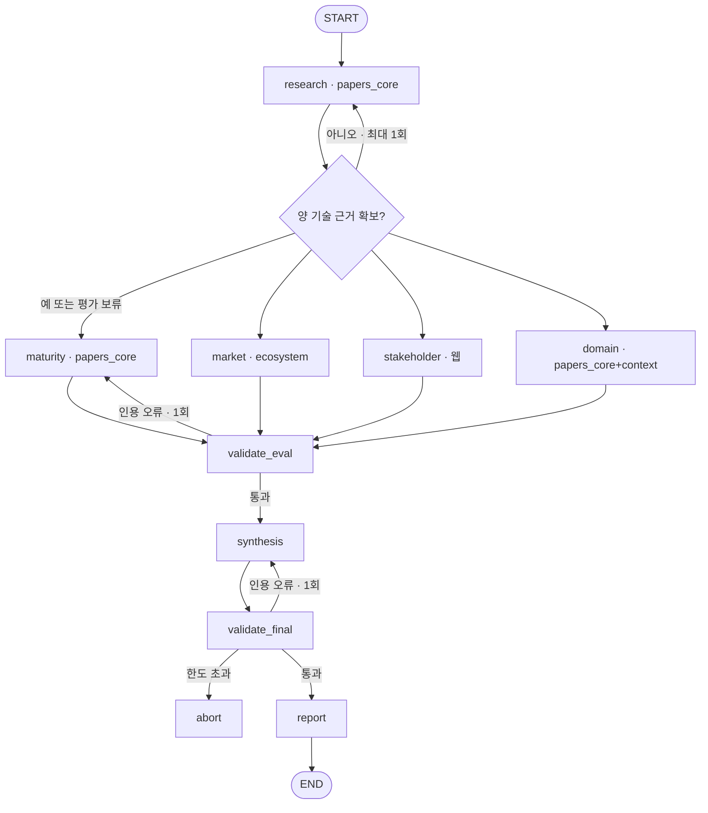

# KV cache 최적화 기술 다관점 평가

SW 압축(**TurboQuant**) vs HW 메모리 접근(**ITME**) — 데이터센터/클라우드 도메인
LangGraph Multi-Agent + Agentic RAG 기반 평가 보고서 자동 생성

**판교 8반** · 권수진 · 권예리 · 김민 · 박인기 · 정승원

---

## 1. 무엇을 하는가

KV cache는 연산 병목을 메모리 병목으로 옮겨 놓았다. SW 진영은 **데이터를 작게**,
HW 진영은 **공간을 넓게** 접근한다. 이 시스템은 두 기술을 TRL·시장성·이해관계자·도메인
네 관점에서 조사하고, **관점 간 근거가 어디서 일치하고 어디서 상충하는지**를 정리한다.

> **우열 판정을 하지 않는다.** 승자를 뽑는 게 아니라 왜 관점마다 답이 달라지는지를 쓴다.

---

## 2. 시스템 구조



**validate를 두 지점에 건다.** 앞쪽(`validate_eval`)이 없으면 평가 노드가 만든
가짜 인용 ID가 §4 본문에 그대로 실린다 — synthesis 재작성만으로는 고쳐지지 않는다.

### 에이전트 7종

| 노드 | 역할 | RAG | 근거 출처 |
|---|---|:---:|---|
| `research` | 접근 방식·적용 범위·한계 추출, `tech_status` 판정 | **O** | `papers_core` |
| `maturity` | TRL 규칙표로 성숙도 판정 | **O** | `papers_core` (다른 쿼리) |
| `market` | 규모·채택·생태계 | **O** | `ecosystem` |
| `stakeholder` | 경쟁·도입·개발자·투자 반응 | X | 웹 (색인 안 함) |
| `domain_assessment` | 데이터센터/클라우드 적합성 | **O** | `papers_core` + `context` |
| `synthesis` | 일치·상충·gaps 병합, 결합 가설 분리 | X | State 읽기 전용 |
| `report` | 목차 조립 | X | 결정적 포맷터 |

가이드 원안 6개에 **TRL 전담 노드를 추가해 7개**. TRL은 4대 평가 관점인데 원안 표에
전담 노드가 없어, 시장 노드가 겸하면 "논문 실험 근거"와 "시장 매출 근거"가 섞인다.

---

## 3. 차별점

**① 근거의 소재에 따라 검색 경로를 나눴다**
시장 근거는 논문 본문에 없다. `papers_core`에서 시장을 검색하면 **의미적으로 가장 가까운
기술 서술**(성능 수치, 실험 하드웨어)이 회수돼 시장 근거 자리에 놓이고, LLM이 그걸로
시장성 주장을 만든다. "자료가 없으면 미확인" 원칙이 무력화된다.
→ 시장 근거를 **`ecosystem` 컬렉션으로 따로 색인**하고, `market` 노드는 그 컬렉션만 본다.
실시간 웹 조회 대신 색인을 택한 이유는 재현성과 200쪽 가드 안에서의 관리다.

**② 우열 판정을 프롬프트가 아니라 스키마로 막았다**
`conflicts: list[Conflict] = Field(min_length=1)`. 관점별 상충이 0건이면 구조 검증에서
걸린다. `favors`는 "종합 승자"가 아니라 "이 관점의 근거가 유리하게 읽히는 쪽"으로 정의된다.
결합 가설은 별도 필드로 빼서 §5.4에만 배치했다. → `src/agents/synthesis.py`

**③ evidence 단일 쓰기 주체**
`maturity`·`domain_assessment`도 인덱스를 조회하지만 `evidence`에 쓰지 않고 자기 키에만
반영한다. 병렬 fan-out에서 동시 쓰기가 **구조적으로 불가능**하다. 누적 reducer는 `trace` 하나.

**④ 인용 검증은 LLM이 아니라 결정적 검사, 그것도 2단계**
`validate_eval`(평가 재실행) / `validate_final`(종합 재작성). 한도 초과 시 조용히
통과시키지 않고 `abort` 노드가 실패를 보고서 자리에 남긴다. → `src/output/validate.py`

**⑤ BM25만 영어 키워드로 변환한다**
BM25는 어휘 매칭이라 한국어 질의로 영어 논문을 못 찾는다. 반면 e5-small은
cross-lingual이라 **한국어 원문 질의를 그대로 넣는 게** 이 모델을 쓰는 이유다.
→ dense는 원문 질의, BM25만 고정 용어사전으로 변환. LLM 번역을 쓰지 않아
지연·비용이 없고 실행 간 결과가 흔들리지 않는다. 변환 이력은 `trace`에 남는다.

---

## 4. RAG 설계

### 3 컬렉션 (설계서 §3)

| 컬렉션 | 내용 | 용도 | 200쪽 가드 |
|---|---|---|:---:|
| `papers_core` | 선정 2건(TurboQuant, ITME) + 비교 참조 2건(KIVI, InfiniGen) | research · maturity · domain | 포함 |
| `ecosystem` | 시장 규모·채택·프레임워크·표준 자료 4건 | market | 포함 |
| `context` | 데이터센터 추론 배경 1건 | domain (배경 서술만) | 포함 |
| (웹 조회) | 이해관계자 반응 | stakeholder | **제외** |

웹 문서는 **3,200자 = 1쪽**으로 환산해 가드에 합산한다. 합계 초과 시 적재를 중단한다.
매니페스트에 SHA-256 · 수집일 · 쪽수 · 청크 수를 기록한다.

> `papers_core`에서 DeepSeek-V2(~50쪽)는 제외했다. 쪽수 압박이 크고 아키텍처 계열이라
> 양자화/메모리확장 비교축과 맞지 않는다. `role=reference`(KIVI·InfiniGen)는 계열 비교
> 인용에만 쓰고 정독·평가셋 대상에서 제외한다.

### 청킹

**토큰 400 / overlap 80**, 임베딩 입력 한도 512 상한.
`RecursiveCharacterTextSplitter.from_huggingface_tokenizer`로 토큰 기준 분할한다.
**표는 행 단위로 쪼개되 매 조각에 헤더 행을 반복**한다 — 표를 통째로 자르면 행이 어느
열에 속하는지 잃어버려 벤치마크 수치 인용이 망가진다.
청크 ID는 `(출처, 페이지, 본문 해시)`라 재실행해도 인용 ID가 안정적이다.

### 검색

dense(FAISS, **원문 질의**) + BM25(**영어 키워드 변환 질의**)를 **RRF**로 융합한다.
두 축에 서로 다른 질의를 넣어야 해서 `EnsembleRetriever` 대신 직접 융합한다
(`score = Σ weight / (k + rank)`, k=60). `technology` 필터로 기술별 검색량을 균형 유지.

### 임베딩 모델 선정 (설계서 §4)

선정 근거는 리더보드 순위가 아니라 **입력 언어(한국어 질의 + 영어 논문), 원문 길이,
로컬 연산/메모리 비용**이다.

| 후보 | 적용 근거 | 결정 |
|---|---|---|
| **multilingual-e5-small** | 한/영 혼재 검색, 384차원, CPU 로컬 실행 | **채택** |
| BGE-M3 | 다국어·긴 입력 | 제외 — 400토큰 청크 설계라 장문 지원이 필요한 전환 조건이 없음. 더 큰 벡터·모델 비용 대비 이득 없음 |
| all-MiniLM-L6-v2 | 짧은 영어 문장 | 제외 — 영어 전용이라 한국어 질의 회수 불가 |

`revision`·차원(384)을 고정해 재실행 간 인덱스가 흔들리지 않게 한다.

**실측** — 설계서 §4 "측정 예정" 칸을 아래로 대체

| mode | 구분 | n | Hit@1 | Hit@3 | Hit@5 | MRR@1 | MRR@3 | MRR@5 |
|---|---|---|---|---|---|---|---|---|
| dense | 전체 / ko / en | | _측정 후 기입_ | | | | | |
| rrf | 전체 / ko / en | | _측정 후 기입_ | | | | | |

완전 회수율@k (같은 사실의 ko·en 문항이 **모두** 회수된 비율): _측정 후 기입_

```bash
uv run python -m eval.retrieval_metrics
```

> 개발용 검색 점검이며 답변의 사실성을 증명하지 않는다.
> 평가셋 20문항을 ko/en × dense/rrf로 나누면 **셀당 n=10**이다. metrics가 n<12에
> 경고를 낸다. dense vs RRF 우열을 주장하려면 24~30문항으로 늘리는 편이 안전하다.

---

## 5. State 17키

각 평가 관점은 **자기 키만** 갱신한다. 누적 reducer는 `trace` 하나뿐이다.
관점 dict 공통 구조는 `{text, citations, gaps}`.

| 키 | 단독 쓰기 주체 |
|---|---|
| `domain` · `sources` | 입력 / 인덱스 매니페스트 |
| `evidence` · `research` · `tech_status` · `gaps` · `retrieval_round` | `research` |
| `maturity` / `market` / `domain_assessment` | 각 노드 |
| `stakeholder` · `web_sources` | `stakeholder` |
| `synthesis` | `synthesis` |
| `validation_errors` · `validation_round` | `output/validate.py` |
| `report` | `report` / `abort` |
| `trace` | 전 노드 (`operator.add`) |

---

## 6. 실행

```bash
uv sync
cp .env.example .env     # OPENAI_API_KEY, TAVILY_API_KEY
```

**인덱스만 점검** (LLM 호출 없음 — API 키 불필요):

```bash
uv run python -m scripts.ingest
```

수집 → 200쪽 가드 → 청킹 → 컬렉션 분리 → 키워드 변환 → 기술별 필터를 한 번에 검증한다.

**전체 파이프라인**:

```bash
uv run python app.py
```

**PDF** (그래프와 분리 — 폰트 문제로 파이프라인이 죽지 않게):

```bash
uv sync --extra pdf && uv run python -m src.output.pdf
```

### 모델 설정

`config/settings.yaml`의 `llm.model`이 기본값이고 `.env`의 `LLM_MODEL`이 우선한다.

> ⚠️ **첫 실행 전 확인**: `gpt-5.6-luna`가 팀 계정에서 호출되는지, 그리고
> **`with_structured_output`(tool calling)을 지원하는지**. 미지원이면 `synthesis`의
> `conflicts` 최소 1건 강제가 무너진다. 안 되면 `.env`에 `LLM_MODEL=gpt-4.1-mini`.

---

## 7. 담당

| 담당 | 트랙 | 파일 |
|---|---|---|
| **R1** | Graph & Runtime | `app.py` · `src/{state,graph,llm,settings}.py` · `src/agents/common.py` · `config/settings.yaml` |
| **R2** | RAG 인프라 (3 컬렉션) | `config/sources.yaml` · `src/rag/{fetch,chunk,embed,index,retrieve,query_kw}.py` · `src/tools/docs.py` · `scripts/ingest.py` |
| **R3** | 시장성 + 이해관계자 | `src/tools/web_search.py` · `src/agents/{market,stakeholder}.py` · `sources.yaml`의 ecosystem·context **자료 선별** |
| **R4** | 논문 소비 에이전트 + 검색 평가 | `src/agents/{research,maturity,domain}.py` · `eval/` |
| **R5** | 종합·보고서·출력 | `src/agents/{synthesis,report}.py` · `src/output/{validate,reference,pdf}.py` · `README.md` |

> `src/settings.py`는 v13 파일 목록에 없는 추가분(R1). R2·R4가 `top_k`·청킹 상수를
> R1의 `llm.py`를 거쳐 가져오는 역참조를 피하려고 분리했다.

### 시작 전 고정할 인터페이스

1. `src/state.py` 17키의 형식 — **R1**
2. chunk 스키마와 `search_source_documents(collection 필수)` 시그니처 — **R2**
3. 관점 dict `{text, citations, gaps}` + citation 형식 `chunk_id` — **R1·R5**
4. **`validation_errors` 형식** `{node, kind, ids}` — **R5**가 쓰고 **R1**이 읽는 유일한 키

1~3만 정하면 R3~R5는 인덱스 완성 전에도 목업 청크로 개발을 시작할 수 있다.

---

## 8. Contributors

| 이름 | 담당 | 주요 산출물 |
|---|---|---|
| ___ | Graph & Runtime | State 17키, LangGraph 배선(조건부 보완·fan-out/fan-in·2단계 검증 라우팅), 평가 노드 공통 헬퍼 |
| ___ | RAG 인프라 | 3 컬렉션 수집·SHA-256 매니페스트·200쪽 가드, 표 헤더 반복 청킹, e5 고정, RRF 하이브리드, 키워드 변환 |
| ___ | 시장성·이해관계자 | ecosystem/context 자료 선별, `search_market_signals`·스냅샷 캐시, 두 평가 노드 |
| ___ | 평가 에이전트 | 기술조사·TRL 규칙표·도메인 노드, 평가셋 20문항, 언어별·모드별 분리 실측 |
| ___ | 종합·출력 | 구조 강제 종합, 인용 검증, REFERENCE 3구분, 한글 PDF, README |

> 기여를 GitHub에 남기려면: 브랜치 `feat/r{n}-<topic>`, 커밋 prefix `[rag]`/`[graph]`,
> 공동 작업분은 `Co-authored-by:` 트레일러.

---

## 9. 보고서 목차 (`output/report.md`)

```
SUMMARY            핵심 평가 결과, ½쪽 이내
1. 분석 배경
2. 기술 선정
3. 기술 개요
4. 관점별 평가      4.1 TRL  4.2 시장성  4.3 이해관계자  4.4 도메인
5. 시사점          5.1 일치  5.2 상충  5.3 근거 공백  5.4 결합 가설(추론)
6. 한계
REFERENCE          [A] Doc Pool 논문  [B] 풀 밖 색인(ecosystem·context)  [C] 웹 조회
```

**REFERENCE 3구분 이유** — 설계서 §9는 "Doc Pool 논문만"이라 쓰고 §3·§6은 웹 자료도
인용한다고 쓴다. 그대로 두면 본문 인용이 참고문헌에 연결되지 않는다. [B]는 색인 대상이라
200쪽 가드에 포함되고, [C]는 색인하지 않으므로 무관하다.

**LLM Judge — 해당 없음.** 인용 검증은 인덱스 실물과 대조하는 결정적 검사이며,
별도 LLM 채점 점수를 만들지 않는다.

---

## 10. Lessons Learned

_실행 후 작성_

---

## 참고자료

- TurboQuant. arXiv:2504.19874 (2025-04) · ITME. arXiv:2606.12556 (2026-06)
- KIVI. ICML 2024, arXiv:2402.02750 · InfiniGen. OSDI 2024, arXiv:2406.19707
- intfloat. multilingual-e5-small. https://huggingface.co/intfloat/multilingual-e5-small
- LangChain. LangGraph Graph API. https://docs.langchain.com/oss/python/langgraph/graph-api
