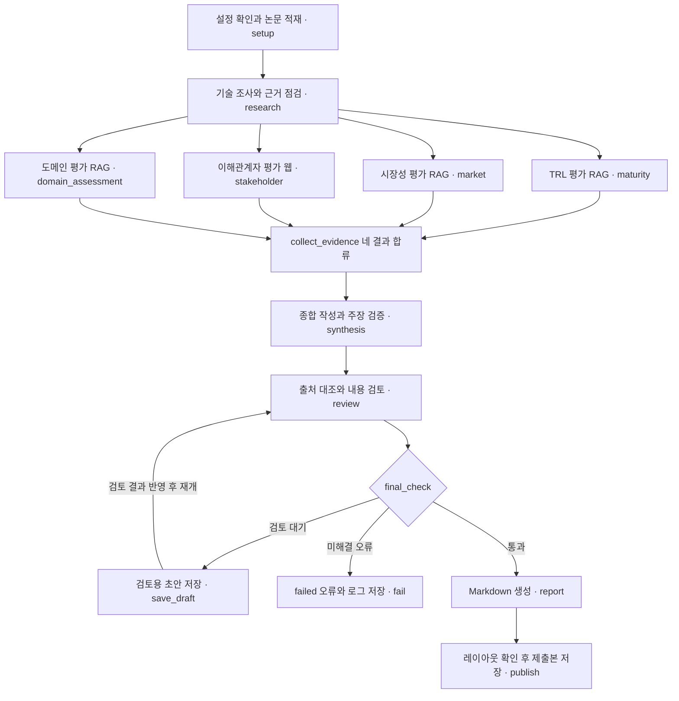

# KV cache 최적화 기술 다관점 평가

KV cache 최적화 기술을 소프트웨어·하드웨어 두 진영에서 선정해 TRL·시장성·이해관계자·도메인
관점에서 비교하고, **근거의 일치·상충을 구조화**하는 Agentic RAG.

**판교 8반** · 권수진 · 권예리 · 김민 · 박인기 · 정승원

- 계약 문서 → [docs/interface.md](docs/interface.md)
- 인수 기록 → [docs/r1-handoff.md](docs/r1-handoff.md) · [docs/r3-handoff.md](docs/r3-handoff.md)

---

## Overview

- **Objective** : 하나의 기술을 복수 관점에서 비교 평가 — 우열 판정이 아니라 관점 간
  근거의 일치·상충을 정리
- **Method** : Multi-Agent(LangGraph fan-out/fan-in) + Agentic RAG
- **Tools** : FAISS(dense 검색), Tavily(웹 검색), pdfplumber(PDF 파싱)

### Selected Technologies

- **SW : TurboQuant** — KV cache를 저비트로 압축해 메모리 병목을 데이터 크기 축소로 해결
- **HW : ITME** — 메모리 접근 공간을 넓혀 KV cache 병목을 하드웨어 관점에서 해결

---

## Features

- PDF·웹 자료 기반 정보 추출 (papers_core 4 · ecosystem 5 · context 1 = PDF 6·웹 4,
  `scripts/prepare_sources.py`가 SHA-256·쪽수 매니페스트 생성)
- 근거 소재별 컬렉션 분리(`papers_core`/`ecosystem`/`context`)로 관점 간 근거 오염 방지
- dense(FAISS, multilingual-e5-small) 단일 검색 + 역할별 컬렉션·scope 접근 제어(`ROLE_COLLECTIONS`)
- 결정적(비-LLM) 인용 검증과 사람의 내용 검토를 `review` 노드에서 수행, 미해결 오류는
  `fail`이 로그를 남기고 제출용 출력을 차단
- 검토 대기 상태에서 실행을 멈추고 사람의 내용 검토 후 재개(`app.py --resume <run_id>`)
- 확증 편향 방지 전략 : 상충을 강제하지 않되(억지 상충 금지) 기술별 검색 기회를 맞추고,
  검색 필터링 + 필터 통과 전 컬렉션 전체를 전수 검색(랭킹 후 필터링)해 비대칭 코퍼스의 쏠림을 완화

## Tech Stack

- **Framework** : LangGraph
- **LLM/Generator** : gpt-5.6-luna (fallback: gpt-4.1-mini)
- **LLM/Judge** : 해당 없음 — 인용 검증은 LLM 채점이 아닌 인덱스 실물 대조 방식의 결정적 검사
- **Retrieval** : FAISS dense 단일 모드 (Hit@K·MRR@K 측정 스크립트 구현, 정답 청크 라벨링
  미완으로 수치 미확정)
- **Embedding** : intfloat/multilingual-e5-small (384차원, cross-lingual, revision 고정)

---

## Agents

| 노드 | 역할 | 근거 |
|---|---|---|
| `research` | 접근 방식·적용 범위·한계 추출, Assessment 반환 | papers_core |
| `maturity` | TRL 규칙표 기반 성숙도 판정 | papers_core |
| `market` | 규모·채택·생태계 평가 | ecosystem |
| `stakeholder` | 경쟁·도입·개발자·투자 반응 평가 | 웹 (색인 안 함) |
| `domain_assessment` | 데이터센터/클라우드 적합성 평가 | papers_core + context |
| `synthesis` | 관점 간 일치·상충·근거 공백 병합, 결합 가설 분리 | State 읽기 |
| `report` | 목차 조립 및 결정적 포맷팅 | State 읽기 |

## Architecture



설계서 부록 A의 그래프 소스를 그대로 옮긴 것이다. **조건부 엣지는 `final_check` 하나뿐**이고,
되돌아오는 엣지는 `save_draft → review`(검토 결과 반영 후 재개) 하나뿐이다. 재시도는 노드
내부의 최대 1회 처리다.

## Directory Structure

```
├── data/                    # 문서 풀 (원문 raw/, 해시·쪽수 manifest.json)
├── src/
│   ├── agents/              # Agent 모듈 (research/maturity/market/stakeholder/domain/synthesis/report)
│   ├── rag/                 # 청킹·임베딩·인덱스·검색
│   ├── tools/               # 색인 검색, 웹 검색/수집
│   ├── output/              # 인용 검증, 내용 검토, 참고문헌, PDF 생성
│   ├── schema.py            # 공용 계약 (Claim/Assessment/Source/Evidence/Gap/Synthesis/Event)
│   ├── state.py             # State (설계서 §7 표 14행 / 17필드)
│   └── graph.py             # LangGraph 배선
├── eval/                    # 검색 품질 평가 (golden set, Hit@K/MRR@K)
├── reviews/verdicts.json    # 내용 검토 판정 원장 (커밋 대상)
├── config/settings.yaml     # 실행 설정
├── runs/                    # run_id별 실행 스냅샷·결과·trace (Git 제외)
├── app.py                   # 실행 스크립트
└── README.md
```

---

## 실행

### 0. 준비

```bash
uv sync                          # 파이프라인 의존성
uv sync --extra pdf              # PDF 제출본까지 만들 때만
brew install pango               # macOS. weasyprint 가 libpango 를 요구한다
cp .env.example .env
```

`.env` 에 키 두 개가 필요하다. **둘 다 없으면 실행이 시작되지 않는다.**

| 키 | 쓰는 곳 | 없으면 |
|---|---|---|
| `OPENAI_API_KEY` | 기술 조사·TRL·시장성·도메인·이해관계자·종합 | `get_llm()` 이 `OpenAIError` 로 즉시 중단 |
| `TAVILY_API_KEY` | 이해관계자 노드의 웹 검색 | stakeholder 가 `status=failed` → 실행 전체 failed |

`pango` 가 없어도 파이프라인은 정상 종료한다. Markdown 까지만 나오고 그 사실이
`runs/<run_id>/submission.json` 에 남는다.

### 1. 원문 수집 (최초 1회)

```bash
uv run python scripts/prepare_sources.py            # 기본: 해시만 검증 (재수집 안 함)
uv run python scripts/prepare_sources.py --refresh  # 원문 재수집 + 매니페스트 갱신
```

`data/raw/` 에 원문이, `data/manifest.json` 에 해시·분량 기록이 생긴다. 원문은 Git 에서
제외한다(15MB).

> **`--refresh` 는 함부로 쓰지 마라.** 원문이 바뀌면 청크가 바뀌고 `chunk_id` 가 전부
> 달라진다. 이전 실행의 인용이 가리키던 원문이 사라지고 `eval/goldenset.json` 라벨도
> 다시 해야 한다. 실제로 `turboquant-blog` 원문이 한 번 바뀐 적이 있다.

### 2. 인덱스 점검 (선택, API 키 불필요)

```bash
uv run python -m scripts.ingest
```

수집 → 200쪽 가드 → 청킹 → 컬렉션 분리 → 기술별 필터를 한 번에 확인한다.

### 3. 파이프라인 실행

```bash
uv run python app.py
```

`setup` 이 원문 SHA-256 을 매니페스트와 대조한다(설계서 §3). 어긋나면 경고를 출력하고
**실행을 중단한다** — 의도한 갱신이면 `--refresh` 로 매니페스트를 다시 만든다.

**첫 실행은 반드시 검토 대기로 멈춘다.** 실패가 아니다. 설계서 §8 이 *이 과정은 ID
대조만으로 자동 통과시키지 않는다. 팀원이 주장과 근거를 나란히 보고 확인한다* 라고
정한다. 이 단계에서는 보고서도 PDF 도 나오지 않는다.

```
검토 대기 — Claim 14건. runs/<run_id>/review.csv 의 review_result(확인|부결)·reviewer 를 채운 뒤
  uv run python app.py --resume <run_id>
```

### 4. 내용 검토

주장과 근거를 나란히 읽는다.

```bash
uv run python -m scripts.review_reader <run_id> --pending
uv run python -m scripts.review_reader <run_id> --claim <claim_id>   # 하나만
```

`runs/<run_id>/review.csv` 의 **마지막 세 열**만 채운다. 앞 열은 읽기용이다.

| 열 | 값 |
|---|---|
| `review_result` | `확인` 또는 `부결` (`통과`·`승인`·`ok` / `반려`·`reject` 도 받는다) |
| `reviewer` | 검토자 이름 |
| `review_comment` | 사유. **부결이면 보고서 §6 에 그대로 실린다** |

한 `claim_id` 당 **한 행만** 채우면 된다(같은 Claim 이 근거 수만큼 행을 갖는다).
값이 `확인`/`부결` 어느 쪽도 아니면 *판정 값 미상* 오류로 실행이 `failed` 가 된다.

§8 이 요구하는 확인 항목 — **성능 수치의 단위·비교 기준선·실험 조건, TRL 단계의 근거,
직접 채택과 인접 생태계 자료의 구분.**

### 5. 재개 → 보고서 + 제출본

```bash
uv run python app.py --resume <run_id>
```

| 산출물 | 경로 |
|---|---|
| 보고서 Markdown | `runs/<run_id>/report.md` |
| 제출본 PDF | `runs/<run_id>/final/RAG-Output_판교_8반_….pdf` |
| 생성 여부와 사유 | `runs/<run_id>/submission.json` |
| 검토 기록 | `runs/<run_id>/review.csv` |
| 실행 기록 | `runs/<run_id>/run.json` · `trace.jsonl` · `state.json` |

PDF 는 **검증을 통과했을 때만** 나온다(§8 — 무효 인용이 남으면 제출용 출력을 막는다).
품질 점검(SUMMARY 분량·한글 글꼴·표 잘림·참고문헌 위치, §9)에 걸려도 만들지 않는다.
왜 안 나왔는지는 `submission.json` 에 적힌다.

### run_status 읽는 법

| 값 | 뜻 |
|---|---|
| `completed` | 보고서 생성, 평가 보류 항목 없음 |
| `partial` | 검토 대기로 멈췄거나, 근거 공백이 남은 채 보고서를 냈다 |
| `failed` | Assessment 중 failed, 미해결 인용 오류, 병합 오류 |

### 모델 설정

`config/settings.yaml` 의 `llm.model` 이 기본값이고 `.env` 의 `LLM_MODEL` 이 우선한다.
실제로 적용된 `temperature`·`seed`·토큰 사용량은 `runs/<run_id>/run.json` 의 `llm` 에
기록된다(설정 파일 값과 다를 수 있다 — 아래 재현성 절 참고).

> ⚠️ `gpt-5.6-luna` 가 팀 계정에서 호출되는지, **`with_structured_output`(tool calling)을
> 지원하는지** 먼저 확인할 것. 미지원이면 `synthesis` 의 구조화 출력이 무너진다.
> 안 되면 `.env` 에 `LLM_MODEL=gpt-4.1-mini`.

---

## 재현성 — 어디까지 되고 어디부터 안 되는가

**같은 보고서가 다시 나오지 않는다.** 이 파이프라인은 그것을 목표로 하지 않는다.

| 단계 | 재현 |
|---|---|
| 원문 → 청킹 → 임베딩 → 인덱스 | ✅ 코퍼스 해시와 임베딩 revision 이 고정돼 있다 |
| 검색 결과 · `chunk_id` | ✅ 같은 인덱스면 동일 |
| **주장 문장** | ❌ 모델이 매 실행 다시 쓴다 |
| **이해관계자 근거** | ❌ 매 실행 웹을 새로 검색한다 |

측정값: 같은 코퍼스로 두 번 돌렸을 때 `maturity` 노드가 **인용 근거 5건이 완전히 같은데
본문 유사도 0.258** 이었다. `langchain_openai` 가 `gpt-5.6-luna` 에 대해 `temperature` 를
보내지 않고(추론형 모델로 취급) `seed` 도 무시되기 때문이다. 조사 기록은
[docs/reproducibility-plan.md](docs/reproducibility-plan.md).

**클론한 사람이 같은 결과를 얻을 수 없다.** `data/raw/`(원문)와 `.cache/`(모델 응답
캐시)가 Git 에서 제외되고, 웹 검색 결과는 애초에 매일 바뀐다. 검증이 목적이라면 재실행이
아니라 `runs/<run_id>/` 의 보고서·근거·검토 기록을 직접 보는 쪽이 맞다.

### 재검토를 줄이는 두 장치

둘 다 재현성의 대체재가 아니라 **사람의 시간을 아끼는 안전망**이다.

**검토 판정 원장** `reviews/verdicts.json` (Git 에 커밋된다)
재개가 끝나면 판정이 자동으로 쌓인다. 다음 실행에서 **node·technology·kind·주장 문장·
인용 근거가 모두 같은** Claim 만 판정을 물려받는다. 한 글자라도 다르면 사람이 읽은 것이
아니므로 미판정으로 남는다. 이월된 판정은 보고서 §6 에 건수와 출처 run_id 가 공시된다.
전부 새로 검토하려면 `--no-carry-review`.

**모델 응답 캐시** `.cache/llm.sqlite` (Git 제외, 기계마다 따로 쌓인다)
키가 프롬프트 전문 + 모델 파라미터다. 같은 코퍼스·같은 지시문이면 같은 응답이 나온다.
프롬프트를 고치면 자동으로 새로 생성한다. 적중 수는 `run.json` 의 `llm` 과 보고서 §6 에
남는다 — 적중은 *이번 실행에서 모델이 새로 판단하지 않았다* 는 뜻이다.

이해관계자 노드는 매 실행 웹을 새로 조사하므로 **프롬프트가 달라져 캐시가 적중하지 않고,
그 Claim 들은 매번 새로 검토해야 한다.**

---

## 보고서 목차

```
SUMMARY            핵심 평가 결과, ½쪽 이내 (전체 목록은 §5·§6)
1. 분석 배경
2. 기술 선정
3. 기술 개요
4. 관점별 평가      4.1 TRL  4.2 시장성  4.3 이해관계자  4.4 도메인
5. 시사점          5.1 일치  5.2 차이·상충  5.3 결합 가설(추론)
6. 한계            근거 공백(관점별) · 조사 시점과 검토 범위 · 분석의 한계
REFERENCE          [A] Doc Pool 논문  [B] 풀 밖 색인(ecosystem·context)  [C] 웹 조회
```

본문 인용은 REFERENCE 번호(`[1]`)로 찍히고, 번호는 제목·arXiv 버전·**인용 페이지**·URL 로
연결된다(§9). 사실 주장은 본문만 싣고 **추론·가설만** 전제와 함께 표시한다(§6).

**REFERENCE 3구분 이유** — 설계서 §9는 "Doc Pool 논문만"이라 쓰고 §3·§6은 웹 자료도
인용한다고 쓴다. 그대로 두면 본문 인용이 참고문헌에 연결되지 않는다. [B]는 색인 대상이라
200쪽 가드에 포함되고, [C]는 색인하지 않으므로 무관하다.

---

## Contributors

| 이름 | 담당 | 주요 산출물 |
|---|---|---|
| 김민 | Graph & Runtime | State(§7 14행/17필드), 공용 `schema.py`, LangGraph 배선, run_id 기반 실행 제어 |
| 권수진 | RAG 인프라 | 3 컬렉션 구성(excerpt 페이징), SHA-256·쪽수 매니페스트, 표/수식 깨짐 검토 마킹, 검색 평가셋 |
| 정승원 | 검색 계층·시장성·이해관계자 | dense 코사인 검색, 역할별 컬렉션·관점 잠금, 웹 근거 수집·스냅샷, 이해관계자 평가 노드 |
| 권예리 | 평가 에이전트 | 기술조사·TRL 규칙표·도메인 노드, 검색 품질 실측 스크립트 |
| 박인기 | 종합·출력 | 구조 강제 종합, 인용 검증, 내용 검토 worksheet, REFERENCE 3구분, PDF 생성 |

---

## 참고자료

- TurboQuant. arXiv:2504.19874 (2025-04) · ITME. arXiv:2606.12556 (2026-06)
- KIVI. ICML 2024, arXiv:2402.02750 · InfiniGen. OSDI 2024, arXiv:2406.19707
- intfloat. multilingual-e5-small. https://huggingface.co/intfloat/multilingual-e5-small
- LangChain. LangGraph Graph API. https://docs.langchain.com/oss/python/langgraph/graph-api
