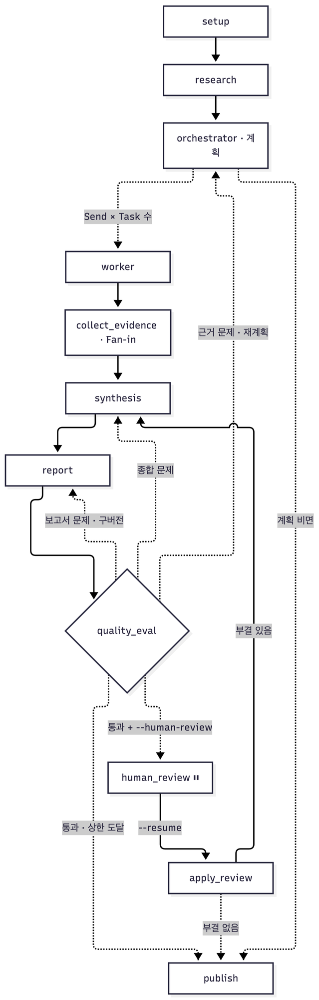

# KV cache 최적화 기술 다관점 평가

[](https://github.com/MK513/kv-cache-rag/actions/workflows/test.yml)


이 프로젝트는 KV cache 최적화 기술을 소프트웨어와 하드웨어 진영에서 각각 선정합니다. 선정한
기술은 TRL·시장·이해관계자·도메인 관점에서 평가하며, 평가 시스템은 **Orchestrator-Workers**
패턴 기반으로 설계하고 개발합니다. 우열 판정이 아니라 **관점 간 근거의 일치·상충을 구조화**합니다.

**판교 8반** · 권수진 · 권예리 · 김민 · 박인기 · 정승원

- 계약 문서 → [docs/interface.md](docs/interface.md)
- 실행 매뉴얼·결과 읽는 법(run_status·재현성·보고서 목차·테스트 구성) → [docs/run-notes.md](docs/run-notes.md)
- 인수 기록 → [docs/r1-handoff.md](docs/r1-handoff.md) · [docs/r3-handoff.md](docs/r3-handoff.md)
- Orchestrator-Workers 계획 → [docs/agent/orchestrator-workers-plan.md](docs/agent/orchestrator-workers-plan.md) · 그래프 → [docs/agent/graph.md](docs/agent/graph.md)

---

## Overview

- **Objective** : 하나의 기술을 여러 관점에서 비교하고 평가합니다 — 우열 판정이 아니라 관점 간
  근거의 일치·상충을 정리합니다.
- **Pattern** : **Orchestrator-Workers**
  - 선정 이유 — 조사를 몇 개로 나눌지가 **실행 시점의 근거 상태**에 따라 달라집니다. 근거가 빈
    칸은 계획 단계에서 근거 공백으로 두고, 나머지 칸 수만큼 Worker 를 보냅니다.
  - trade-off — 얻는 것: 분해 사유 추적, 병렬 실행, 부족한 칸만 재조사. 치르는 것: 계획 비용,
    계획의 비결정성(결정적 개수 규칙으로 완화), 실행 중 즉시 재배치 불가(평가 후 재계획으로만 조정).
- **동적 처리** : 고정 순서(`research → maturity·market·stakeholder·domain 4개 고정 fan-out`)와 달리
  Worker 목록이 코드에 없습니다. orchestrator 가 근거 가용성을 보고 세운 `plan` 의
  Task 수만큼 `Send` 로 Worker 를 띄우고(최초 4~7개, 상한 8), `quality_eval` 이 평가 결과로 다음 노드
  (재계획·synthesis·report·발행)를 고릅니다. 실패한 Worker 칸은 `execution_gap` 으로 남고 재계획 때 다시 조사합니다.

---

## Selected Technologies

- **SW : TurboQuant** — KV cache 를 저비트로 압축해 메모리 병목을 **데이터 크기 축소**로 해결합니다.
  선정 이유: 학습 없이 적용하는 온라인 양자화라 서빙 스택(vLLM 등) 채택 여부로 시장성·생태계를
  관찰할 수 있고, 원 논문과 Google Research 공개 자료로 근거를 확보할 수 있습니다.
- **HW : ITME** — CXL 하이브리드 메모리로 TB급 원격 메모리를 붙여, 호스트 메모리를 넘는 KV cache 를
  **하드웨어 쪽 용량 확장**으로 수용합니다(GPU 로 다단 DMA 선반입).
  선정 이유: SW 압축과 같은 병목을 반대 방향에서 푸는 접근이라 관점 간 일치·상충을 비교하기에
  적합합니다. 직접 원문이 SK hynix 자료뿐이라는 근거 비대칭은 편향 예외로 공개합니다.

---

## Features

- PDF·웹 자료 기반 정보 추출 (papers_core 4 · ecosystem 5 · context 1 = PDF 6·웹 4,
  `scripts/prepare_sources.py`가 SHA-256·쪽수 매니페스트 생성) + 이해관계자 관점은 실행마다 웹 수집
- 근거 소재별 컬렉션 분리(`papers_core`/`ecosystem`/`context`)와 역할별 접근 제어(`ROLE_COLLECTIONS`)로
  관점 간 근거 오염 방지
- 모든 주장은 `Claim → Evidence → Source` 로 원문 위치까지 이어지고, 근거가 없으면 Gap 으로 남깁니다
  (`evidence_gap`·`execution_gap`·`invalid_evidence`)
- **확증 편향 방지** : 상충을 강제하지 않고 기술별 검색 기회를 맞춥니다. 아래 bias 기준을 못 넘는
  구조적 비대칭(ITME)은 보고서 §6 에 예외로 공개합니다.
- **보고서 품질 평가** : 코드 검사 → LLM Judge 의 Hybrid. 아래 6기준을 실제로 표시된 보고서
  (`report_manifest`)에 대해 평가하고, 실패 기준에 따라 재작업 노드를 고릅니다.

| 기준 | 코드 검사 | Judge | 실패 시 |
|---|---|---|---|
| groundedness_l1 | 표시 Claim 의 claim→evidence→source 연결 | 근거가 주장을 뒷받침하는가 (층화 표본) | 재계획 |
| groundedness_l2 | 종합 항목이 표시된 유효 Claim 만 가리키는가 | 참조 범위를 벗어난 서술인가 | synthesis |
| neutrality | 승자·추천·우열 표현 패턴 | 우열 판정·조건 다른 수치의 단순 비교 | synthesis |
| bias | ① 출처 묶음 ≥ 2 ② 단일 묶음 ≤ 60% (기술별) | ③ 선택적 근거 사용 | 재계획 |
| coverage | 4관점 × 2기술 칸마다 유효 Claim 또는 근거 공백 | 관점을 실질적으로 다루는가 | 재계획 |
| structure | SUMMARY 처음·REFERENCE 끝·인용 일치·렌더링 쪽수(10쪽) | — | report |

- 선택 단계로 사람의 내용 검토(`--human-review`) 후 재개(`app.py --resume <run_id>`)
- 모든 라우팅 결정과 사유를 `runs/<run_id>/decisions.jsonl` 에 남깁니다

---

## Tech Stack

| 구분 | 내용 |
|---|---|
| Framework | LangGraph 1.x (`Send` 동적 fan-out, `InMemorySaver`, `interrupt_after`) |
| LLM / Generator | gpt-4.1-mini (temperature 0, seed 고정) — 계획·생성·종합 |
| LLM / Judge | gpt-4.1-mini (`llm.judge_model` 로 분리 가능). 코드 검사를 통과한 기준만 Judge 가 봅니다 |
| Retrieval | FAISS dense(코사인) 단일 모드. 평가 지표 Hit Rate@K 와 MRR@K (`eval/retrieval_metrics.py`) |
| Embedding | intfloat/multilingual-e5-small (384차원, revision 고정) — 한국어 질의로 영어 원문을 찾는 cross-lingual 검색, CPU 로 돌아가는 크기 |

---

## Agents

- **Orchestrator** (`orchestrator`) : 근거 가용성 사전 조사 → 결정적 개수 규칙 → LLM 이 Task 별 focus·질의만 채움. 재계획은 실패·지목된 칸만
- **선행 조사** (`research`) : 접근 방식·적용 범위·한계 추출 (papers_core)
- **Workers** (`worker`) : Task 의 관점별 에이전트 실행 → `worker_results` 누적
  - `maturity` TRL 판정 (papers_core) · `market` 규모·채택·생태계 (ecosystem) · `stakeholder` 경쟁·도입·투자 반응 (웹) · `domain_assessment` 데이터센터/클라우드 적합성 (papers_core + context)
- **Fan-in** (`collect_evidence`) : 라운드별 유효 결과의 출처·근거 병합. ID 충돌 시 실행 중단
- **Synthesis** (`synthesis`) : 관점 간 일치·상충·근거 공백 정리
- **Report** (`report`) : 목차 조립, 10쪽 상한 압축
- **Evaluator** (`quality_eval`) : 6기준 평가 후 다음 노드 결정
- **Human Review** (`human_review` · `apply_review`, 선택) : worksheet 에서 멈춘 뒤 부결 Claim 을 빼고 재종합
- **Publish** (`publish`) : 평가한 버전 = 발행할 버전 확인 후 제출본 저장

---

## State Schema

정의는 [src/state.py](src/state.py), 형식은 [src/schema.py](src/schema.py).

| 항목 | 설계 |
|---|---|
| 제어 vs 페이로드 분리 | 제어: `plan`, `retry_count`, `repair_count`, `step_count`, `guard_retry_count`, `claim_flags`, `last_decision`, `last_error`, `stop_reason`, `run_status` / 페이로드: `research`, 관점별 Assessment 4개, `worker_results`, `source_registry`·`evidence_registry`, `gaps`, `synthesis`, `report`, `report_manifest`, `quality_eval` |
| 관측성 위치 | 계획 전문·재시도 대상 선택·품질 판정 사유는 `runs/<run_id>/decisions.jsonl` + LangSmith. State 에는 `last_decision` 요약만 둡니다 |
| 지속성 비용 | 누적 필드는 `worker_results`·`trace` 둘뿐입니다. `worker_results` 는 라운드당 최대 8건 × 3라운드 = 최대 24건, `trace` 는 가벼운 이벤트만. 원본 결과·웹 스냅샷·이전 보고서는 State 가 아니라 `runs/<run_id>/` 파일에 둡니다. `Send` 는 현재 State 전체에 `task` 를 붙여 넘깁니다(체크포인트 크기는 실측 전) |
| 상관 | `run_id` = LangGraph thread_id = LangSmith `metadata.run_id`. 결정·Worker 결과마다 `task_id`·`round`·`report_version` 을 남깁니다 |
| 재개/복구 | `InMemorySaver`(프로세스 내). 상태 `plan`·`run_status` / 에러 `last_error`·`worker_results[].error_kind`·`stop_reason` / 재시도 `retry_count`·`repair_count`·`step_count`. 같은 `task_id` 결과는 1회만 반영합니다. 사람 검토 재개는 `state.json` 을 새 스레드에 올려 `apply_review` 부터 잇습니다 |
| 동시 처리 | `Send` Worker 는 `worker_results`·`trace` 에만 쓰고 `operator.add` 로 병합합니다. 도착 순서에 의존하지 않도록 `(round, task_id)` 로 정렬하고, Claim ID 는 `task_id` 접두로 전역 유일합니다. State 밖 공유 자원(웹 수집 파일)은 Task 별 폴더로 나눕니다 |
| 종료 보장 | 재계획 2회·수리 2회·결정 12회·웹 검색 16회 등 아래 상한을 추가 실행 **전에** 검사하고, 닿으면 멈추지 않고 `partial` 로 발행합니다. 마지막 안전장치는 `recursion_limit` 60 |

상한 (`config/settings.yaml` 의 `orchestrator`)

| 상한 | 값 | 닿으면 |
|---|---|---|
| `max_retry` | 2 | 재계획 라운드. 근거 문제가 남아도 `partial` 로 발행 |
| `max_workers` | 8 | 한 라운드의 Task·Worker 수. 넘친 대상은 결정 로그에 남김 |
| `max_repairs` | 2 | synthesis·report 수리 횟수 |
| `max_steps` | 12 | orchestrator·quality_eval 결정 수 |
| `max_guard_retries` | 2 | 구버전 보고서 재생성. 닿으면 publish 가 `failed` |
| `max_searches` | 16 | 실행 전체 웹 검색 예산 (라운드마다 새로 주지 않습니다) |
| `max_judge_retries` | 1 | Judge 호출 재시도. 그래도 실패하면 `partial` |
| `recursion_limit` | 60 | LangGraph 안전장치 |

---

## Architecture



노드별 분기 조건과 실제 `draw_mermaid()` 출력은 [docs/agent/graph.md](docs/agent/graph.md).

---

## Directory Structure

```
├── data/                    # 문서 풀 (원문 raw/, 해시·쪽수 manifest.json)
├── src/
│   ├── agents/              # Agent 모듈 (research/maturity/market/stakeholder/domain/synthesis/report/worker)
│   ├── orchestrator/        # 계획(planner)·dispatch·결과 선택·품질 평가(evaluator·quality_rules)·publish guard
│   ├── rag/                 # 청킹·임베딩·인덱스·검색
│   ├── tools/               # 색인 검색, 웹 검색/수집
│   ├── output/              # 인용 검증, 내용 검토, 참고문헌, PDF 생성
│   ├── schema.py            # 공용 계약 (Claim/Assessment/Source/Evidence/Gap/Synthesis/Event)
│   ├── state.py             # State (설계서 §7 17필드 + Orchestrator-Workers 제어·페이로드 필드)
│   ├── observability.py     # 결정 로그 (decisions.jsonl)
│   └── graph.py             # LangGraph 배선
├── eval/                    # 검색 품질 평가 (golden set, Hit@K/MRR@K)
├── scripts/                 # 원문 수집·인덱스 점검·τ 보정·검토 열람
├── tests/                   # pytest (단위·통합)
├── reviews/verdicts.json    # 내용 검토 판정 원장 (커밋 대상)
├── config/settings.yaml     # 실행 설정
├── runs/                    # 실행 결과 저장 (= 템플릿의 outputs/). run_id별 스냅샷·보고서·trace (Git 제외)
├── app.py                   # 실행 스크립트
└── README.md
```

프롬프트는 별도 `prompts/` 폴더 없이 각 에이전트 모듈 안에 있습니다.

---

## Usage

```bash
uv sync                                   # 의존성 (PDF 제출본: uv sync --extra pdf + brew install pango)
cp .env.example .env                      # OPENAI_API_KEY · TAVILY_API_KEY
uv run python scripts/prepare_sources.py  # 원문 수집·해시 검증 (최초 1회)
uv run python app.py                      # 실행 — 품질 평가 통과 시 발행
uv run python app.py --human-review       # 통과 후 사람 검토(review.csv)에서 멈춤
uv run python app.py --resume <run_id>    # 검토를 채운 뒤 재개
```

결과는 `runs/<run_id>/` 에 남습니다 — 보고서 `report.md`, 제출본 `final/*.pdf`, 품질 평가
`quality-v<N>.json`, 결정 로그 `decisions.jsonl`. 원문 해시가 매니페스트와 어긋나면 `setup` 이
실행을 중단합니다. 키가 없을 때의 동작, 검토 CSV 작성법, 산출물 전체, 모델 설정, 그 밖의 옵션
(`--run-id`·`--domain`·`--no-carry-review`)은 [docs/run-notes.md](docs/run-notes.md#실행-매뉴얼) 에 있습니다.

---

## Tests

```bash
uv run pytest -q   # 288 passed — API 키·원문(data/raw/) 없이 돈다
```

푸시와 PR 마다 GitHub Actions 가 같은 명령을 돌립니다. 테스트 구성은
[docs/run-notes.md](docs/run-notes.md#테스트-구성).

---

## Limitations

- Generator 와 Judge 가 같은 모델(gpt-4.1-mini)입니다. Judge 는 층화 표본(`quality.judge_sample` 60건)만 봅니다.
- 계획의 개수는 결정적 규칙이지만 focus·질의 문장은 LLM 이 써서 실행마다 달라질 수 있습니다.
- 체크포인트가 `InMemorySaver` 라 프로세스 간 재개는 사람 검토 재개(`state.json`)만 지원합니다.
- 칸 단위로 결과를 교체하므로, 재조사에서 다시 나오지 않은 기존 Claim 은 보고서에서 빠집니다.
- 편향 기준 임계값(묶음 ≥ 2, 비중 ≤ 60%)은 작은 코퍼스(문서 10건)에서 실측 보정 전입니다.

---

## Contributors

| 이름 | 담당 | 주요 산출물 |
|---|---|---|
| 김민 | Orchestrator · Graph & Runtime | Orchestrator 설계(동적 계획·Dynamic Fan-out·재계획), Worker 어댑터·Fallback, 그래프·State 통합, 실행·트레이스, CI |
| 권예리 | Worker 에이전트 | Task 기반 조사로 에이전트 전환, 근거 수집·웹 수집 분리, 공통 함수 정리, 기술조사·TRL 규칙표·도메인 노드 |
| 권수진 | 품질 평가·발행 | 종합·보고서 생성, 품질 평가 노드(Hybrid)·재작업 라우팅, 발행·분량 관리, Human Review / RAG 인프라(3 컬렉션, 매니페스트) |
| 정승원 | 검색 계층·시장성·이해관계자 | dense 코사인 검색, 역할별 컬렉션·관점 잠금, 웹 근거 수집·스냅샷, 이해관계자 평가 노드 |
| 박인기 | 출력·인용 검증 | 구조 강제 종합, 인용 검증, 내용 검토 worksheet, REFERENCE 3구분, PDF 생성 |

---

## References

- TurboQuant. arXiv:2504.19874 (2025-04) · ITME. arXiv:2606.12556 (2026-06)
- KIVI. ICML 2024, arXiv:2402.02750 · InfiniGen. OSDI 2024, arXiv:2406.19707
- intfloat. multilingual-e5-small. https://huggingface.co/intfloat/multilingual-e5-small
- LangChain. LangGraph Graph API. https://docs.langchain.com/oss/python/langgraph/graph-api
