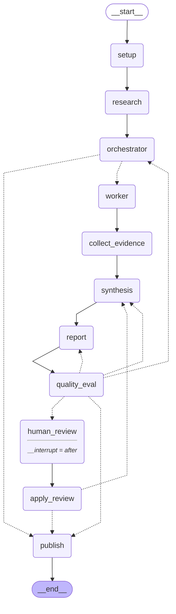

# 그래프 (A4)

`build_graph().get_graph().draw_mermaid()` 출력. 실선은 고정 엣지, 점선은 조건부 엣지
(`dispatch`·`route_after_eval`·`route_after_review`).

- `orchestrator -.-> worker` 는 `Send` 로 계획의 Task 수만큼 Worker 를 띄운다.
- `human_review` 는 선택 단계다(`--human-review`). 그래프는 이 노드 뒤에서 멈추고(`interrupt_after`),
  `app.py --resume <run_id>` 가 `apply_review` 부터 잇는다.
- `quality_eval -.-> report` 에는 publish guard 구버전 재생성도 포함된다. 횟수는
  `guard_retry_count`, 상한 `orchestrator.max_guard_retries`(2). 닿으면 publish 가 failed 로 끝낸다.

