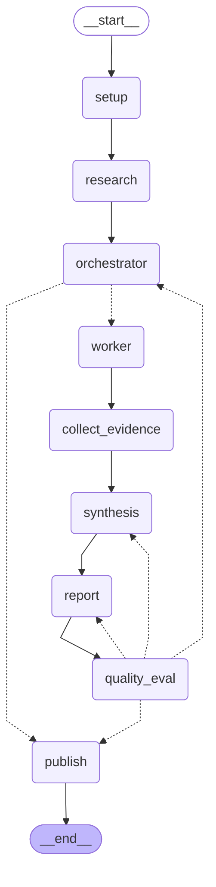

# 그래프 (A1 뼈대)

`build_graph().get_graph().draw_mermaid()` 출력. 실선은 고정 엣지, 점선은 조건부 엣지(`dispatch`·`route_after_eval`).
`orchestrator -.-> worker` 는 `Send` 로 계획의 Task 수만큼 Worker 를 띄운다.

```mermaid
---
config:
  flowchart:
    curve: linear
---
graph TD;
	__start__([<p>__start__</p>]):::first
	setup(setup)
	research(research)
	orchestrator(orchestrator)
	collect_evidence(collect_evidence)
	synthesis(synthesis)
	report(report)
	quality_eval(quality_eval)
	publish(publish)
	worker(worker)
	__end__([<p>__end__</p>]):::last
	__start__ --> setup;
	collect_evidence --> synthesis;
	orchestrator -.-> publish;
	orchestrator -.-> worker;
	quality_eval -.-> orchestrator;
	quality_eval -.-> publish;
	quality_eval -.-> report;
	quality_eval -.-> synthesis;
	report --> quality_eval;
	research --> orchestrator;
	setup --> research;
	synthesis --> report;
	worker --> collect_evidence;
	publish --> __end__;
	classDef default fill:#f2f0ff,line-height:1.2
	classDef first fill-opacity:0
	classDef last fill:#bfb6fc
```
